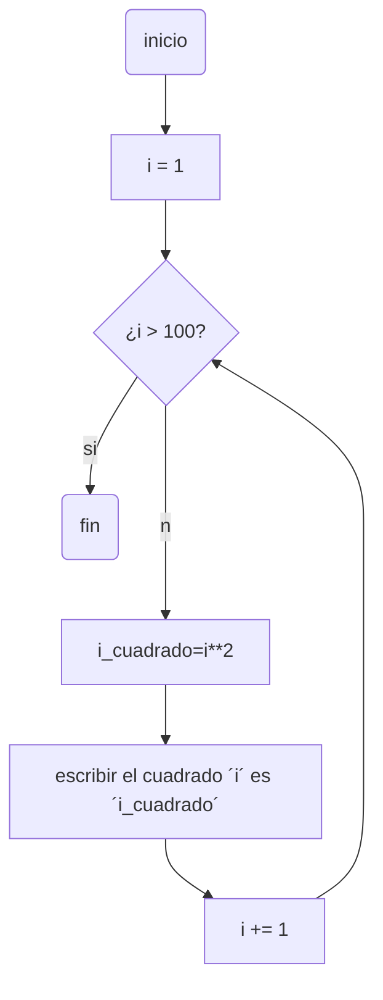
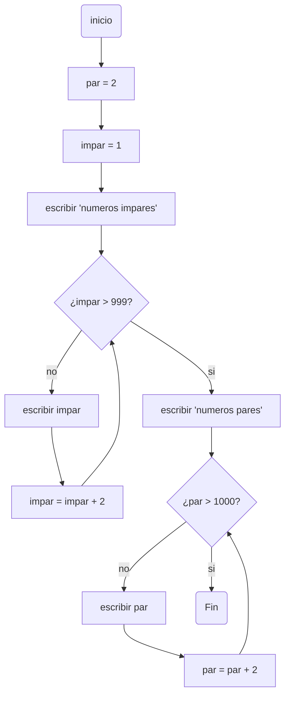
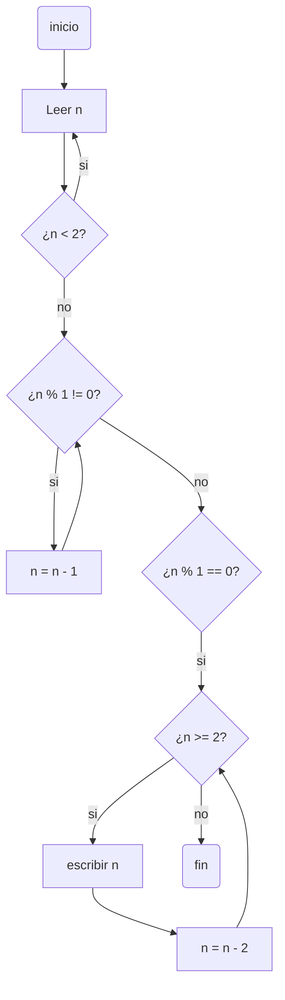

# pdc_reto_7
### Soy Rafael Santiago Chirivi Peña y pertenezco al grupo de "Fenomenoides", adelante se muestra nuestro logo 

<details><summary>Preparense para ver el grandioso logo: </summary><p>
<div align='center'>
<figure> </br>
<figcaption><b> "somos programadores, no diseñadores" </b></figcaption></figure>
</div>
</p></details><br>

### A continuacion, se muestran las soluciones propuestas a los distintos puntos de este reto
## 1. Imprimir un listado con los números del 1 al 100 cada uno con su respectivo cuadrado.

```python
i : int = 1     # se indica una constante i a la cual anclar el while
if __name__ == "__main__":
    while i <= 100:     # condicion del ejercicio 
        i_cuadrado = i ** 2     # operacion de cuadrado para i
        print(f"EL cuadrado de {i} es {i_cuadrado}")
        i += 1      # escalado para la constante
```

## Y segun lo solicitado, aqui esta el diagrama de flujo



## 2. Imprimir un listado con los números impares desde 1 hasta 999 y seguidamente otro listado con los números pares desde 2 hasta 1000.

```python
par : int = 2       # constante par
impar : int = 1     # constante impar
if __name__ == "__main__":
    print ("Numeros impares")
    while impar <= 999:     # condicion del ejercicio 
        print(impar)
        impar += 2      # escalado para la constante
    print("Numeros pares")
    while par <= 1000:      # condicion del ejercicio 
        print(par)
        par += 2        # escalado para la constante
```

## Y segun lo solicitado, aqui esta el diagrama de flujo



## 3. Imprimir los números pares en forma descendente hasta 2 que son menores o iguales a un número natural n ≥ 2 dado

```python
if __name__ == "__main__":
    try:
        n : int = int(input("Por favor, ingrese un entero: "))    #ingreso de entero n
        while n < 2:
            n = int(input("El entero ingresado debe ser mayor o igual que 2, por favor intentelo de nuevo"))
        if n%2 != 0: #de impar a par
            n -= 1
        if n%2 == 0:
            while n >= 2: # condicion del ejercicio  
                print(n)
                n -= 2 #escalado para la variable
    except ValueError:
        print("El valor ingresado no se trata de un numero entero")
```

## Y segun lo solicitado, aqui esta el diagrama de flujo



## 4. En 2022 el país A tendrá una población de 25 millones de habitantes y el país B de 18.9 millones. Las tasas de crecimiento anual de la población serán de 2% y 3% respectivamente. Desarrollar un algoritmo para informar en que año la población del país B superará a la de A.

```python
A : float = 25000000    #constante de poblacion A
B : float = 18900000    #constante de poblacion B
anio = 2022
if __name__ == "__main__":
    print(f"para el año {anio} el pais A tiene una poblacion de {A} habitantes, mientras que el pais B cuenta con {B} habitantes \n habiendo una diferencia de {A - B} habitantes")
    while B < A:    # condicion del ejercicio 
        A += (A * 2) / 100      # crecimiento poblacional A
        B += (B * 3) / 100      # crecimiento poblacional B
        anio += 1   # escalado para la constante año
    print(f"para el año {anio} el pais A tiene una poblacion de {A} habitantes, mientras que el pais B cuenta con {B} habitantes \n habiendo una diferencia de {B - A}")
```

## 5. Imprimir el factorial de un número natural n dado.

```python
fact : int = 1      #constante 
numero : int = 1    #constante
if __name__ == "__main__":
    try:
        n : int = int(input("Ingrese un numero entero positivo al que obtener el factorial: ")) #ingreso de numero para aplicar operacion
        while n < 0:
            n = int(input("El numero ingresado no se trataba de un entero positivo, por favor intentelo de nuevo: "))
        while n > 1: #limite de regresion
            fact = fact * n #operacion de factorial
            n -= 1 #regresion hasta 1
            numero += 1
        if n == 0: #caso especial 0!
            fact = 1
            numero = 0
        print(f"el factorial del numero ingresado {numero} es {fact}")
    except ValueError:
        print("El numero ingresado no se trata de un numero entero")
```

## 6. Implementar un algoritmo que permita adivinar un número dado de 1 a 100, preguntando en cada caso si el número es mayor, menor o igual.

```python
import random       # se importa la libreria random para generar el numero
if __name__ == "__main__":
    try: 
        adiv : int = random.randint(1, 100)     # generar el numero y asignarlo a una variable
        intento : int = input("Por favor, trate de adivinar el numero generado por la maquina, este se encuentra entre 1 y 100: ")      # ingreso del valor para adivinar
        while str(intento) != str(adiv):    # ciclo hasta adivinar
            if str(intento) > str(adiv):    # caso adivinanza mayor que numero generado
                intento = int(input("El numero ingresado esta por encima del numero generado, por favor, intentelo de nuevo: "))
            if str(intento) < str(adiv):    # caso adivinanza mayor que numero generado
                intento = int(input("El numero ingresado esta por debajo del numero generado, por favor, intentelo de nuevo: "))
        print(f"Felicidades! has adivinado el numero generado, este era {adiv}")
    except ValueError:
        print("El valor ingresado no se trata de un numero entero")
```

## 7. Implementar un programa que ingrese un número de 2 a 50 y muestre sus divisores.

```python
i : int = 1 #constante denominador
if __name__ == "__main__":
    try: 
        n : int = int(input("Por favor, ingrese un numero entero entre 2 y 50: ")) #ingreso de entero n dentro del rango
        while n < 2 or n > 50:
            n = int(input("El numero ingresado no se encuentra dentro del rango establecido, por favor intentelo de nuevo: "))
        while i <= n:   #rango para la evaluacion de denominadores hasta n/n
            divisor = n/i
            if divisor % 1 == 0: #condicion para que i sea divisor de n
                print(f"{i} es divisor de {n}")
            i += 1      #escalado para el denominador
    except ValueError:
        print("El numero ingresado no se trata de un numero entero")
```

## 8. Implementar el algoritmo que muestre los números primos del 1 al 100. Nota: use funciones

```python
def primo (n : int = 1, i : int = 1,) -> str:
    while n <= 100:     #delimitacion del rango 1 a 100
        i = 1
        while i <= n - 1: #rango para la evaluacion de denominadores hasta n/n
            divisor = n / i
            if divisor % 1 == 0 and n == 2:     #caso especial n = 2 siendo primo
                print(f"{n} es un numero primo \n")
            if divisor % 1 == 0 and i != 1:     #condicion para no primos, excluyendo a n/1
                print(f"{n} no es un numero primo \n")
                break
            if divisor % 1 != 0 and i == n - 1: #condicion para primos
                print(f"{n} es un numero primo \n")
            i += 1  #escalado para el denominador
        n = n + 1   #escalado de 1 a 100
if __name__ == "__main__":
    primo()
```
